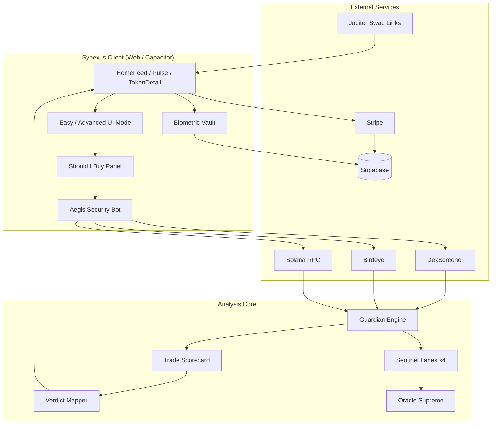

# Synexus IP Attorney Packet

**Prepared for:** Founder forming **Synexus LLC** (pending)  
**Brand (strict):** **Synexus** only — not HiveMind  
**Product:** Non-custodial Solana token intelligence platform (web + Android/iOS via Capacitor)  
**Primary domain:** https://synexus.pro  
**Bundle ID:** `com.synexus.app`  
**Document date:** June 2026  
**Codebase location:** `hivemind-app` repository (legacy folder name — do not use in filings)

> **Disclaimer:** This packet is a technical and business inventory prepared to assist legal counsel. It is not legal advice. All filings should be reviewed and submitted by a licensed attorney.

---

## Table of contents

1. [Executive summary](#1-executive-summary)
2. [LLC formation checklist (before filing IP)](#2-llc-formation-checklist-before-filing-ip)
3. [Trademark inventory — Synexus brand](#3-trademark-inventory--synexus-brand)
4. [Brand assets for USPTO specimens](#4-brand-assets-for-uspto-specimens)
5. [Invention disclosures (provisional patent candidates)](#5-invention-disclosures-provisional-patent-candidates)
6. [Draft patent claim themes (attorney to refine)](#6-draft-patent-claim-themes-attorney-to-refine)
7. [System architecture](#7-system-architecture)
8. [Data flow diagrams](#8-data-flow-diagrams)
9. [Trade secrets (do not publish)](#9-trade-secrets-do-not-publish)
10. [Prior art & differentiation notes](#10-prior-art--differentiation-notes)
11. [Copyright inventory](#11-copyright-inventory)
12. [Documents to bring to first attorney meeting](#12-documents-to-bring-to-first-attorney-meeting)
13. [Legacy naming — exclude from filings](#13-legacy-naming--exclude-from-filings)
14. [Suggested filing sequence & budget ranges](#14-suggested-filing-sequence--budget-ranges)

---

## 1. Executive summary

Synexus is an AI-assisted, **non-custodial** command center for Solana traders. Users paste a token mint or symbol and receive a plain-English **“Should I buy this?”** verdict (Avoid / High risk / Watch / OK). Behind that verdict runs a **Guardian Engine** (weighted risk scoring), four specialized **Sentinels** (Aegis, Pulse, Titan, Cipher), and **Oracle Supreme** (synthetic commander layer for briefings and chat).

Differentiators counsel should evaluate:

- **Multi-lane Sentinel fusion** → single consumer verdict + optional deep scorecard  
- **Client-side Aegis security bot** integrated into scans, auth, Oracle chat, and **Pro subscription tamper detection**  
- **Easy / Advanced UI modes** — progressive disclosure for beginners vs. power users  
- **Biometric Operator Link** — native Face ID / fingerprint re-auth using **refresh token in secure enclave** (not password storage)  
- **Time-boxed Pro demo** with trusted grant provenance (`stripe_checkout`, `supabase_profile`, `demo_session`, `owner`)  
- **Automated marketing pipeline** — branded video generation + multi-platform daily posting  

Intelligence is **informational** (not trade execution or custody). Users sign all trades in their own wallets (Phantom, etc.).

---

## 2. LLC formation checklist (before filing IP)

Complete **LLC formation first** (or in parallel), then file trademarks/patents **in the LLC name** as owner of record.

| Step | Action |
|------|--------|
| 1 | Choose state (often founder’s home state or Wyoming/Delaware — attorney/advisor choice) |
| 2 | File Articles of Organization as **Synexus LLC** (exact name TBD with secretary of state availability) |
| 3 | Obtain EIN from IRS |
| 4 | Open business bank account |
| 5 | Adopt **Operating Agreement** |
| 6 | Execute **IP Assignment Agreement** — founder assigns all pre-LLC code, marks, domains, and inventions to **Synexus LLC** |
| 7 | Register domain **synexus.pro** in LLC name (or assign from individual) |
| 8 | Update app store developer accounts to LLC entity |
| 9 | Re-file USPTO applications with **Synexus LLC** as applicant after assignment |

**Critical:** Do not file federal TM/patents in a personal name if the intent is LLC ownership — assignment gaps create ownership disputes.

---

## 3. Trademark inventory — Synexus brand

### Primary marks (recommended federal filings)

| Priority | Mark | Type | Notes |
|----------|------|------|-------|
| **P1** | **SYNEXUS** | Standard character mark | Primary brand name |
| **P1** | **Synexus** (same, stylized if used consistently) | Word mark | Matches UI copy |
| **P2** | Synexus logo / wordmark | Design mark | Specimen: `public/synexus-wordmark.png` |
| **P2** | Synexus symbol / emblem | Design mark | Specimen: `public/synexus-symbol.png` |
| **P3** | **SHOULD I BUY THIS?** | Word/slogan mark | Only if used consistently as source identifier (hero headline, marketing) — counsel to advise on descriptiveness |
| **P3** | Syn-Bunny mascot | Design mark | `public/syn-bunny.svg` — if used in commerce |

### Secondary marks (product features — counsel discretion)

| Mark | Consider? | Notes |
|------|-----------|-------|
| **Sentinels** / **The Synexus Sentinels** | Maybe | Descriptive of function; may need acquired distinctiveness argument |
| **Oracle Supreme** | Maybe | Character name for AI layer |
| **Aegis** | Maybe | Security subsystem name; check conflicts in software/security |
| **Synexus Pro** | Yes (with P1) | Subscription tier name |
| **$SyN / SyN** | Separate | Community token on pump.fun — likely **Class 36** or separate goods; distinct from app brand |

### Do **not** register as primary brand

- HiveMind, Hive Mind, hivemind-*  
- hivemindtoken.ai (legacy domain in `src/config/ecosystem.ts`)  
- Internal IDs: `hivemind-sol`, `hivemind-supabase-auth`

### Suggested USPTO classes (attorney to confirm)

| Class | Description (draft) |
|-------|---------------------|
| **9** | Downloadable mobile application software for cryptocurrency market analysis and risk assessment; computer software for blockchain token screening |
| **42** | Software as a service (SAAS) featuring software for cryptocurrency market intelligence, risk scoring, and non-custodial trading decision support |
| **36** (optional) | Financial information and analysis services related to digital assets — **heavily examined**; attorney guidance required |

### First use in commerce (founder to confirm dates)

Document and provide screenshots for:

- [ ] **synexus.pro** live site (earliest deploy date)  
- [ ] Google Play / App Store listing (when published)  
- [ ] Marketing posts (Telegram, YouTube, etc.) showing **Synexus** mark  
- [ ] In-app Operator Link / Should I Buy UI with mark visible  

### USPTO filing notes (2025 fee structure)

- Base application: **~$350 per class** ([USPTO fee schedule](https://www.uspto.gov/learning-and-resources/fees-and-payment/uspto-fee-schedule))  
- Use **ID Manual** goods/services IDs to avoid surcharges  
- Search before filing: [USPTO Trademark Search](https://tmsearch.uspto.gov/)  

### Immediate use before registration

You may use **Synexus™** on website, app, and marketing now. Use **®** only after federal registration.

---

## 4. Brand assets for USPTO specimens

| Asset | File path | Use |
|-------|-----------|-----|
| Wordmark | `public/synexus-wordmark.png` | TM specimen, marketing |
| Full logo | `public/synexus-logo.png` | Design mark |
| Symbol / emblem | `public/synexus-symbol.png` | App icon source, design mark |
| Favicon | `public/favicon.svg` | Web |
| Syn-Bunny mascot | `public/syn-bunny.svg`, `public/syn-bunny.png` | Marketing mascot |
| Circuit background | `public/circuit-background.png` | UI trade dress (optional design patent) |
| Video frame template | `marketing-ai/generated/synexus-frame.svg` | Marketing watermark |
| Android icons | `android/app/src/main/res/mipmap-*/` | App store |

**Legacy assets — do not use in TM specimens:**  
`public/hivemind-brain.png`, `hivemind-wordmark.png`, `hivemind-logo.svg`, `hivemind-logo-art.png`

---

## 5. Invention disclosures (provisional patent candidates)

Each section follows a standard invention disclosure format: **Problem → Solution → Novel elements → Key implementation files**.

---

### Invention 1: Multi-lane Sentinel monitoring with Oracle Supreme commander layer

**Problem:** Crypto traders receive fragmented alerts (price, whales, rugs, social) with no unified command narrative.

**Solution:** Four specialized Sentinel lanes continuously evaluate a token pool; a fifth **Oracle Supreme** layer synthesizes lane outputs into directives, briefings, and conversational responses tied to user watchlists and alerts.

**Novel elements (for counsel):**
- Fixed four-lane taxonomy (risk / momentum / whales / fusion) with XP/level gamification per lane  
- Oracle issues per-lane **directives** consumed by UI (`oracleDirective` on live intel)  
- Sentinel live intel: response time, precision, scans/min metrics per lane  

**Key files:**
- `src/data/syntheticWatchers.ts`
- `src/lib/sentinelIntel.ts`
- `src/lib/sentinelAlerts.ts`
- `src/lib/oracleCryptoBrain.ts`
- `src/components/OracleAdminControlCenter.tsx`
- `src/pages/Pulse.tsx`

---

### Invention 2: Guardian Engine — configurable weighted token risk scoring

**Problem:** Memecoin risk is multidimensional; single-metric tools miss composite failure modes.

**Solution:** A configurable scoring engine ingests ~20 signals (liquidity USD, holder concentration, token age, volatility, volume quality, impersonation flags, community reports, mint/freeze authority, etc.) and outputs `SAFE | WARNING | DANGER`, numeric score, confidence, and enumerated reasons.

**Novel elements:**
- Runtime-mergeable config (`guardian-config.json` + overrides)  
- Confidence derived from reason count + report volume  
- Applied uniformly at token build time (`buildTokenFromPartial`)  

**Key files:**
- `src/data/guardianEngine.ts`
- `src/data/tokens.ts`
- `src/services/guardianConfigService.ts`
- `public/guardian-config.json`

---

### Invention 3: “Should I Buy?” plain-language verdict pipeline

**Problem:** Risk dashboards overwhelm beginners; traders need a single actionable answer before connecting a wallet.

**Solution:** Composite pipeline maps Guardian status + trade scorecard (rug-pull level, whale activity, liquidity health, momentum) to discrete verdicts **AVOID | HIGH_RISK | WATCH | OK**, with beginner-mode simplification (Don’t buy / Very risky / Wait & watch / Looks okay).

**Novel elements:**
- Dual presentation layer (Easy vs Advanced) from same analysis core  
- Example-token chips for one-tap demo (BONK, SYN, SOL)  
- Security gate (`guardTokenScan`) before lookup  

**Key files:**
- `src/lib/shouldIBuy.ts`
- `src/lib/tradeScorecard.ts`
- `src/components/ShouldIBuyPanel.tsx`
- `src/services/marketDataService.ts` (`lookupTokenByQuery`)

---

### Invention 4: Aegis client-side security bot with Pro grant integrity

**Problem:** Client-side apps are vulnerable to abuse (scan spam, credential stuffing, XSS in chat, localStorage Pro tampering).

**Solution:** Embedded **Aegis** security bot enforces rate limits, threat pattern matching (injection, phishing, drainer language, fake Synexus hosts), device fingerprinting, clipboard guards, and **trusted Pro grant verification** with cross-tab tamper watch and optional remote audit to Supabase.

**Novel elements:**
- `recordTrustedPlanGrant()` with enumerated sources and max age per source  
- `enforceStoredPlan()` strips invalid PRO from localStorage  
- Integrated guards on: token scan, auth, Oracle chat, API fetch, report submission  
- CLI audit: `npm run aegis:check`  

**Key files:**
- `src/lib/securityBot/SecurityBot.ts`
- `src/lib/securityBot/index.ts`
- `src/lib/securityBot/patterns.ts`
- `src/lib/securityBot/rateLimit.ts`
- `src/lib/securityBot/remoteAudit.ts`
- `supabase/security_events.sql`
- `scripts/aegis-check.mjs`

---

### Invention 5: Biometric Operator Link (refresh token secure vault)

**Problem:** Password re-entry on mobile friction; storing passwords in app storage is unsafe.

**Solution:** After successful email/password login to **Operator Link**, user enrolls biometrics; app stores Supabase **refresh token** (not password) in Capacitor Secure Storage (Keychain/Keystore). Subsequent sign-in prompts biometric verification, then restores session via `refreshSession`.

**Novel elements:**
- Auto-enrollment prompt immediately after first successful auth  
- Vault persists across sign-out (session ends; biometric re-login remains available)  
- Explicit disable clears vault only  
- Native-only; web shows guidance to use mobile app  

**Key files:**
- `src/lib/biometricLogin.ts`
- `src/hooks/useBiometricLogin.ts`
- `src/components/PulseOperatorLink.tsx`
- `src/pages/Pulse.tsx`
- `src/lib/supabaseData.ts` (`restoreSessionFromRefreshToken`)

**Dependencies:** `@aparajita/capacitor-biometric-auth`, `capacitor-secure-storage-plugin`

---

### Invention 6: Time-boxed Pro demo with trusted grant chain

**Problem:** Users won’t subscribe without experiencing Pro; naive localStorage PRO flags are trivially spoofed.

**Solution:** 5-minute Pro demo writes a time-limited grant with source `demo_session`; Aegis validates grant provenance alongside Stripe and Supabase profile sync.

**Key files:**
- `src/lib/proDemo.ts`
- `src/hooks/useProDemo.ts`
- `src/components/ProDemoButton.tsx`, `ProDemoBanner.tsx`

---

### Invention 7: Easy / Advanced progressive UI mode

**Problem:** Same product must serve beginners and power users without two apps.

**Solution:** Persistent `simple | advanced` mode toggles feed density, copy, scorecard visibility, nav labels, and Oracle presence.

**Key files:**
- `src/hooks/useSynexusUIMode.ts`
- `src/components/UIModeToggle.tsx`
- `src/components/BeginnerQuickStart.tsx`
- `src/pages/HomeFeed.tsx`
- `src/pages/Pulse.tsx`

---

### Invention 8: Automated branded marketing video + multi-platform blast pipeline

**Problem:** Solo founders cannot manually post video content 3× daily across platforms.

**Solution:** Node pipeline generates daily copy packs, TTS voiceover (Edge TTS), SVG circuit-board video art with Synexus watermark, and posts to YouTube, Telegram, Discord, Reddit, TikTok, Meta, X.

**Key files:**
- `marketing-ai/synexusMarketingBot.js`
- `marketing-ai/dailyBlastPost.js`
- `marketing-ai/videoPipeline.js`, `makeVideo.js`, `videoArt.js`
- `marketing-ai/platforms/*`

---

## 6. Draft patent claim themes (attorney to refine)

These are **starting points** for independent claims — not filed claims.

### Claim set A — Verdict pipeline
1. A computer-implemented method comprising: receiving a blockchain token identifier; fetching market and on-chain metadata from a plurality of APIs; computing a multi-factor risk score using a configurable guardian rules engine; computing a trade scorecard including rug-pull assessment and whale concentration; mapping said scores to a discrete consumer verdict selected from avoid, high-risk, watch, and acceptable; and presenting said verdict in plain language prior to initiating a non-custodial wallet transaction.

### Claim set B — Sentinel fusion
2. A system comprising a plurality of sentinel monitoring lanes, each lane assigned a domain of token analysis; a fusion lane configured to escalate token status when signals from at least two lanes exceed thresholds; and a commander layer configured to generate natural-language directives to each lane based on aggregated token pool state and user watchlist context.

### Claim set C — Aegis integrity
3. A client-side security module intercepting user actions in a web application, the module configured to: rate-limit token scan requests per device fingerprint; validate subscription tier claims against a session-stored grant record having an enumerated trusted source; and revert locally stored premium flags when the grant record is absent, expired, or from an untrusted source.

### Claim set D — Biometric session restore
4. A mobile application method comprising: upon successful password authentication with an identity provider, prompting a user to enroll biometric authentication; storing a refresh token in a hardware-backed secure store; upon subsequent launch, verifying biometric identity and restoring a user session by exchanging said refresh token with said identity provider without re-entry of a password.

### Claim set E — Progressive UI
5. A method for presenting cryptocurrency analysis software in a first simplified mode hiding technical scorecards and a second advanced mode exposing multi-lane sentinel feeds, wherein both modes consume a common analysis backend.

**Counsel note:** Expect §101 (abstract idea) and obviousness rejections. Emphasize **specific technical improvements**: tamper-resistant grant chain, secure enclave token storage, multi-lane fusion escalation logic, integrated guard pipeline.

---

## 7. System architecture



---

## 8. Data flow diagrams

### 8.1 Token scan → verdict

```
User input (mint / symbol)
    │
    ▼
guardTokenScan() ──[blocked]──► error message
    │ allowed
    ▼
lookupTokenByQuery()
    ├── DexScreener pair lookup
    ├── pool token match
    └── buildTokenFromPartial()
            └── evaluateGuardianRisk() [Guardian Engine]
    │
    ▼
buildTradeScorecard()
    │
    ▼
analyzeShouldIBuy()
    ├── AVOID      (DANGER / elevated rug / score ≥ 65)
    ├── HIGH_RISK  (WARNING / score ≥ 45 / high whales)
    ├── WATCH      (mixed signals)
    └── OK         (passes basic screen)
    │
    ▼
ShouldIBuyPanel UI (+ optional TradeIntelligenceScorecard in Advanced mode)
```

### 8.2 Operator Link auth + biometrics

```
Email/password sign-in
    │
    ▼
guardAuthAttempt() [Aegis]
    │
    ▼
Supabase signInWithPassword
    │
    ├──► load user profile, watchlists, Pro tier
    │
    └──► enrollBiometricAfterLogin() [native only]
              │
              ├── biometric prompt
              ├── store refresh_token in Secure Storage
              └── Preferences flag: enabled

Sign-out
    │
    ├── Supabase signOut (session cleared)
    └── biometric vault RETAINED (for next biometric sign-in)

Biometric sign-in (return visit)
    │
    ▼
biometric prompt → load vault → refreshSession(refresh_token)
```

### 8.3 Pro entitlement integrity

```
Legitimate PRO sources:
  stripe_checkout | supabase_profile | demo_session | admin | owner

recordTrustedPlanGrant(plan, source) → sessionStorage

On app load:
  enforceStoredPlan()
    ├── localStorage says PRO?
    ├── valid grant in sessionStorage?
    └── if mismatch → strip PRO, log security event
```

---

## 9. Trade secrets (do not publish)

Keep confidential under NDA; **do not** include in open-source or marketing:

| Secret | Location |
|--------|----------|
| Guardian weight tuning / thresholds | `public/guardian-config.json`, `guardianEngine.ts` |
| Aegis threat patterns & rate limit thresholds | `src/lib/securityBot/patterns.ts`, `rateLimit.ts` |
| Owner command credentials | `.env` — `SYNEXUS_OWNER_*` |
| Oracle briefing generation logic & prompts | `src/lib/oracleCryptoBrain.ts` |
| Marketing API tokens | `marketing-ai/.env` |
| Stripe webhook secrets | Vercel env |
| Supabase service role key | Server env only |
| Verdict threshold constants | `src/lib/shouldIBuy.ts`, `tradeScorecard.ts` |

**Recommendation:** Mark repo private; use NDAs for contractors; add trade secret clause to Operating Agreement.

---

## 10. Prior art & differentiation notes

Counsel should search and distinguish:

| Category | Examples | Synexus differentiation angle |
|----------|----------|--------------------------------|
| Token scanners | RugCheck, Token Sniffer, GoPlus | Plain-English **Should I buy?** verdict + Easy mode + Sentinel narrative |
| Analytics | DexScreener, Birdeye, Bubblemaps | **Non-custodial** decision layer before swap; integrated Aegis abuse protection |
| Wallets | Phantom, Solflare | Synexus does not custody or sign; deep-links to Jupiter |
| AI crypto tools | Various Telegram bots | Multi-lane Sentinel + Oracle commander + in-app Operator Link account |
| Security | Generic WAF | **Client-side** Aegis with Pro grant tamper detection |

**Important:** Synexus **uses** DexScreener/Birdeye/Jupiter — patents should focus on **novel combination and methods**, not API usage alone.

---

## 11. Copyright inventory

Automatic copyright exists in original works. Optional registration ([copyright.gov](https://www.copyright.gov/)):

| Work | Description |
|------|-------------|
| Application source code | Full TypeScript/React codebase |
| Marketing videos | `marketing-ai/output/` generated MP4s |
| Syn-Bunny mascot art | SVG/PNG |
| Synexus wordmark & logo | PNG assets |
| Video art templates | `videoArt.js`, `synexus-frame.svg` |

**Author / owner after assignment:** Synexus LLC

---

## 12. Documents to bring to first attorney meeting

- [ ] This packet (printed or PDF)  
- [ ] Government ID  
- [ ] LLC formation documents (once filed)  
- [ ] IP Assignment Agreement (founder → Synexus LLC)  
- [ ] Domain registration proof for **synexus.pro**  
- [ ] Screenshots: homepage, Should I Buy, Pulse Operator Link, app store listing  
- [ ] Date of first public use of **Synexus** mark  
- [ ] List of contractors who contributed (work-for-hire / assignment status)  
- [ ] Git log export or signed tag showing early commit dates (optional, for priority)  
- [ ] `.env.example` redacted — shows integrations without secrets  

---

## 13. Legacy naming — exclude from filings

| Legacy term | Where it appears | Action |
|-------------|------------------|--------|
| HiveMind | Old docs, iOS bundle HTML, some images | Do not trademark; migrate UI to Synexus assets |
| hivemind-app | Repo folder name | Cosmetic; not public brand |
| hivemind-sol | Internal token ID for $SYN | Internal only |
| hivemind-supabase-auth | localStorage key | Internal only |
| hivemindtoken.ai | `ecosystem.ts` | Legacy domain — deprecate |
| hivemind-brain.png | HomeFeed hero (still loaded) | **Replace with synexus-symbol.png before TM specimens** |

---

## 14. Suggested filing sequence & budget ranges

| Order | Filing | Est. cost (USD) | Timeline |
|-------|--------|-----------------|----------|
| 1 | Form **Synexus LLC** + IP assignment | $50–$500 + attorney | 1–4 weeks |
| 2 | TM **SYNEXUS** word mark (Classes 9 + 42) | ~$700 USPTO + $1k–2k attorney | 8–14+ months |
| 3 | TM design mark (logo) | ~$350+ per class | parallel or after word mark |
| 4 | **Provisional patent** (Claim sets A + B or C + D) | ~$70 USPTO + $3k–8k attorney | 12-month priority window |
| 5 | Non-provisional utility (before month 12) | $10k–25k+ | 3–5 years examination |
| 6 | Copyright registration (marketing videos + code deposit) | ~$65–$500 | Optional |

---

## Appendix A — Product & company facts (for TM application forms)

| Field | Value |
|-------|-------|
| **Mark** | SYNEXUS |
| **Applicant (planned)** | Synexus LLC |
| **Goods/Services (draft)** | Downloadable software and SaaS for cryptocurrency token risk analysis and non-custodial trading decision support |
| **Website** | https://synexus.pro |
| **Support email** | support@synexus.pro |
| **App name** | Synexus |
| **Bundle ID** | com.synexus.app |
| **Platform** | Web, Android, iOS |
| **Subscription** | Synexus Pro — $19.99/month |
| **Community token** | $SyN (pump.fun) — separate from app TM counsel |

---

## Appendix B — Key source file index

```
src/data/guardianEngine.ts       — Risk scoring engine
src/lib/shouldIBuy.ts            — Verdict pipeline
src/lib/securityBot/             — Aegis security bot
src/lib/biometricLogin.ts        — Biometric auth vault
src/lib/proDemo.ts               — Pro demo grants
src/data/syntheticWatchers.ts    — Sentinel definitions
src/lib/oracleCryptoBrain.ts     — Oracle Supreme intel
src/hooks/useSynexusUIMode.ts    — Easy/Advanced mode
src/components/PulseOperatorLink.tsx — Operator Link UI
src/config/site.ts               — Public brand copy
marketing-ai/                    — Marketing automation pipeline
api/checkout.ts, api/webhook.ts  — Stripe Pro billing
supabase/schema.sql              — User data model
capacitor.config.ts              — com.synexus.app
public/synexus-*.png             — Brand assets
```

---

## Appendix C — Founder action items (this week)

1. **File Synexus LLC** in chosen state  
2. **Sign IP assignment** to LLC immediately after formation  
3. **Book trademark attorney** — bring this packet + specimens from `public/synexus-wordmark.png`  
4. **Replace hivemind-brain.png** in HomeFeed with Synexus symbol before TM specimens  
5. **Screenshot** synexus.pro + Pulse Operator Link for first-use evidence  
6. **Book patent attorney** — ask: “Provisional for Claim sets A + C + D?”  
7. **Keep repo private** until counsel advises otherwise  

---

*End of packet. Update LEGAL_EFFECTIVE_DATE and LLC legal name once formation is complete.*
